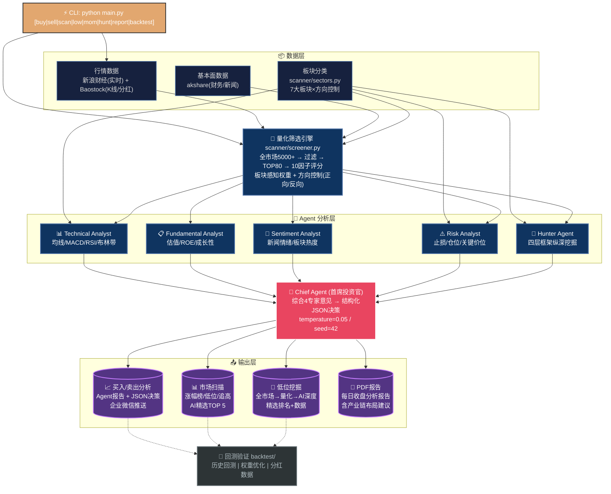
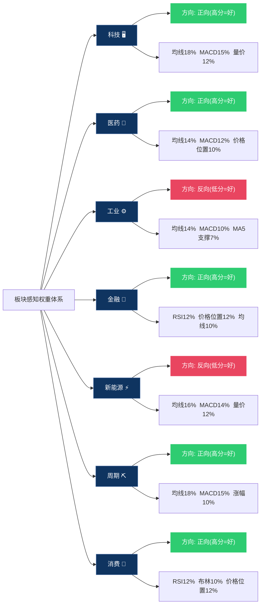
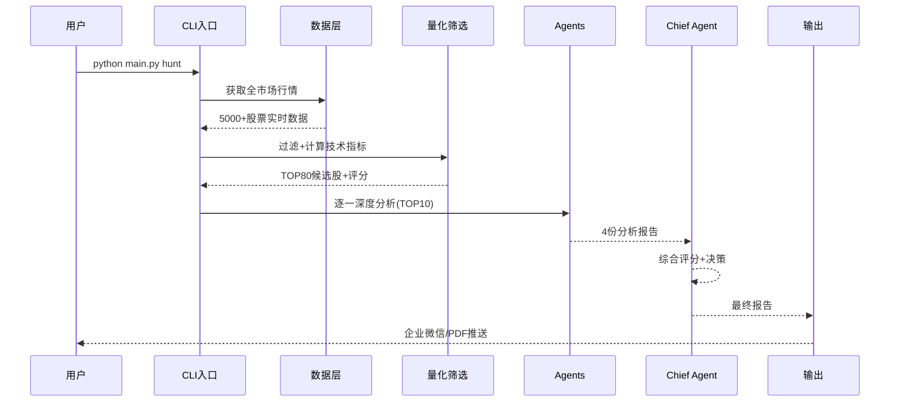

# 📊 项目架构流程图

> 此流程图由 `tools/generate_flowchart.py` 自动生成，项目变更后重新运行即可同步。

## 整体架构

## 板块策略权重矩阵

## 数据流全景

## 命令参考速查

| 命令 | 功能 | 耗时 |
|------|------|------|
| `python main.py buy` | 买入分析（4 Agent + Chief） | ~3-5分钟/10只 |
| `python main.py sell` | 持仓卖出分析 | ~2-3分钟/5只 |
| `python main.py scan` | 涨幅榜扫描 | ~20秒 |
| `python main.py low` | 低位潜力股筛选 | ~30秒 |
| `python main.py mom` | 追高跟强筛选 | ~30秒 |
| `python main.py hunt` | 低位挖掘深度分析 | ~3-5分钟 |
| `python main.py report` | 生成每日PDF报告 | ~2分钟 |
| `python main.py backtest` | 单次回测验证 | ~1分钟 |
| `python main.py btmulti` | 多日期综合回测 | ~5分钟 |

---

> **流程图自动生成**: 运行 `python tools/generate_flowchart.py` 更新 PNG 图表
> **最后更新**: 项目 git 提交记录
